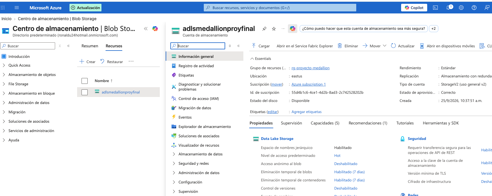
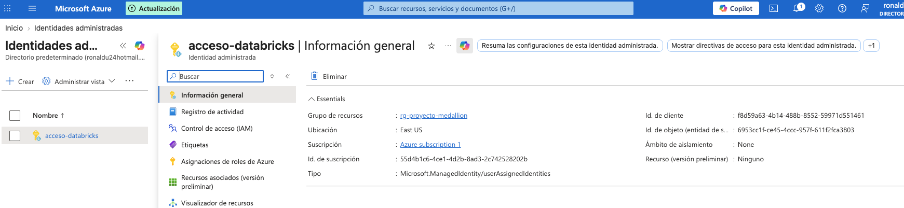
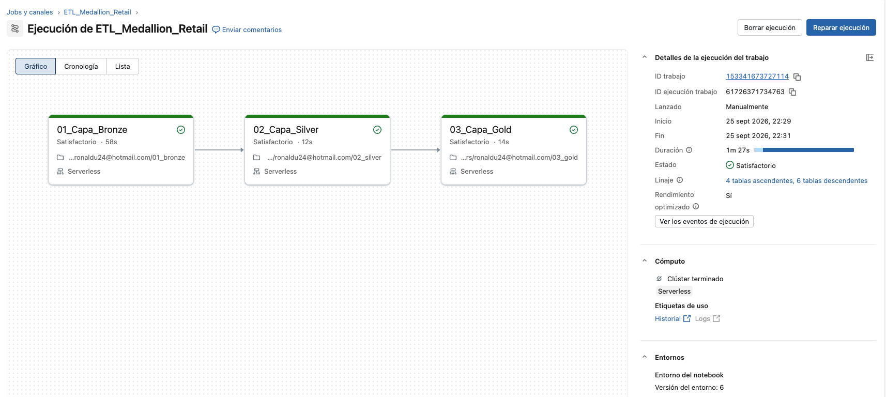
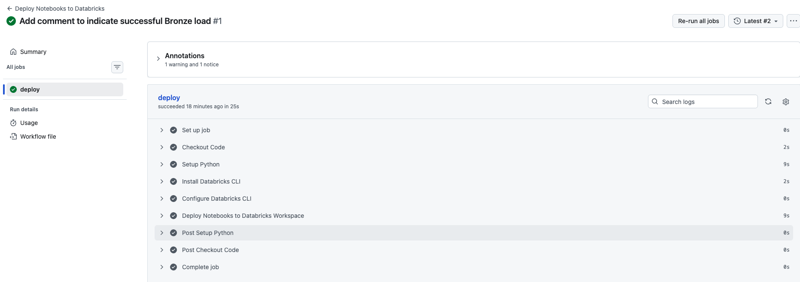
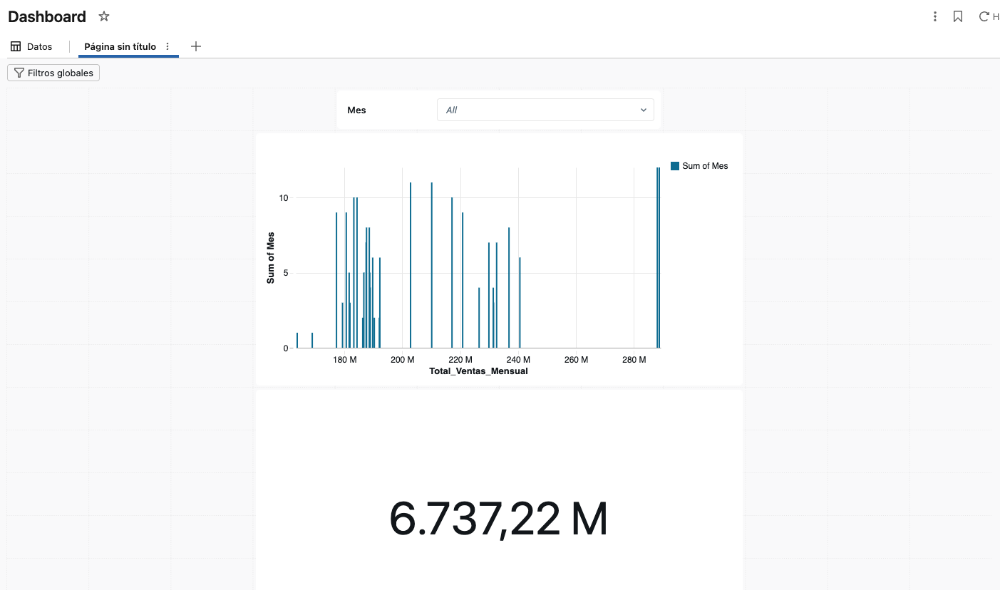

# Proyecto Final: ETL en Azure Databricks con Arquitectura Medallion

## Descripción del Proyecto
Este proyecto implementa un pipeline de datos (ETL) utilizando Azure Databricks y PySpark, estructurado bajo la arquitectura Medallion (Capa Bronze, Silver y Gold). El objetivo principal es la ingesta, transformación y agregación de datos provenientes de Kaggle, simulando un entorno de producción con control de versiones y despliegue automatizado.

## Tecnologías Utilizadas
* **Cloud:** Azure (Data Lake / Storage Account, Managed Identities)
* **Procesamiento:** Azure Databricks, PySpark, Unity Catalog
* **Orquestación:** Databricks Workflows
* **CI/CD:** GitHub Actions
* **Visualización:** Databricks Dashboards (Lakeview)

## Estructura del Repositorio
* `datasets/`: Insumos originales utilizados para el ETL.
* `proceso/`: Notebooks de PySpark con la lógica de las capas Bronze, Silver y Gold.
* `PrepAmb/`: Scripts de preparación de ambiente (Catálogos, Esquemas, External Locations).
* `seguridad/`: Scripts para asignación de permisos (Grants).
* `reversion/`: Scripts para limpieza de entorno (Drop tables).
* `.github/workflows/`: Archivos YAML para el despliegue automatizado.
* `dashboard/`: Captura de los gráficos finales de la capa Gold.
* `evidencias/`: Capturas de pantalla de la ejecución y servicios.

## Evidencias de Ejecución

### 1. Servicios Aprovisionados en Azure
Se configuró el almacenamiento externo y la conexión segura mediante Managed Identity:

### 2. Orquestación (Databricks Workflow)
Ejecución exitosa de los notebooks en el ambiente de producción:

### 3. Integración y Despliegue (CI/CD)
Ejecución exitosa del pipeline de GitHub Actions para el despliegue del código:

### 4. Visualización de Datos
Dashboard final consumiendo las tablas agregadas de la capa Gold:

